

  <h2>Concordia University</h2>
  <h2>SOEN-357: User Interface Design</h2>
   
  <h1>HealthPro: A Case Study</h1>
   
   
  
Andrei Jianu (40275653)

  
February 20, 2026

---

> **WEBSITE VERSION CAN BE FOUND HERE *https://meloniouss.github.io/soen357miniproject/**

# Table of Contents

1. [Introduction](#1-introduction)
2. [User research and persona creation](#2-user-research-and-persona-creation)
3. [User journey mapping](#3-user-journey-mapping)
4. [Wireframing and prototype design](#4-wireframing-and-prototype-design)
5. [Usability Testing Plan](#5-usability-testing-plan)
6. [Reflection](#6-reflection)

# 1. Introduction

In the current healthcare landscape, a significant barrier to effective treatment is the lack of patient adherence to medication regimens. While traditional tools like physical pill organizers and basic calendar reminders exist, they often fail to provide the redundancy necessary for high-stakes medical management. HealthPro is designed as a modern intervention within the "Swiss Cheese" model of error prevention, acting as a comprehensive health ecosystem that bridges the gap between the physician's office and the patient's home. By integrating automated medication scanning to reduce cognitive load, quick logging for high-efficiency users, and high-priority escalated alerts for more distracted individuals, HealthPro provides a multi-layered safety net. This application aims to minimize the risk of missed doses and streamline the point of contact between patients and their healthcare providers, ensuring more reliable treatment outcomes across diverse demographics.

> The Swiss cheese model essentially states that the more layers of defense we have against something, the lower the odds of an error occuring. From the point of view of a patient, the more methods you have to ensure their medication intake, the lower the odds they skip a dose.

---

# 2. User research and persona creation

## 2.1 User research

User research was conducted through a comprehensive competitive audit and sentiment analysis of market-leading applications, specifically focusing on Medisafe (5M+ downloads) and MyChart (the industry standard for patient portals, 10M+ downloads). By analyzing feedback from a massive user base, we identified critical failure points in existing solutions. This approach provides greater statistical significance than small-scale surveys, as it captures the real-world frustrations of chronic patients over several years of usage. This allowed us to build our personas based on real-world scenarios where existing apps failed to prevent medical errors or caused "app abandonment," rather than relying on hypothetical responses to a questionnaire.

### The notification problem

A primary finding was the tension between notification fatigue and reliability. Users with ADHD or high cognitive loads reported that standard push notifications are too easily dismissed or ignored. One user noted that full-screen notifications were "vital for my ADHD-riddled self who just ignores normal notifications," while a senior user emphasized that they needed an app that "simply will not let me forget" by notifying them repeatedly until an action is logged. This directly informed our notification strategy: high-priority medications utilize a tiered system where a passive nudge escalates into a persistent, full-screen alarm if ignored.

### Visual aids

We identified a heavy reliance on visual cues to ensure safety. Users expressed a strong preference for being able to see the physical characteristics of their medication to prevent errors. As one reviewer noted, "color-coded medicine shapes allow me to see the actual shape, color, type, and quantity... I can visually identify them!" To address this, we integrated a Visual Pill Library and OCR Scanning. This allows users to rely on visual recognition rather than struggling with small text or complex medical names, significantly reducing the risk of accidental double-dosing.

### Communication friction

Our research identified a significant disconnect in how patients share data with healthcare providers. Analysis of MyChart feedback revealed that users often feel ignored by the system, citing confusing messaging protocols and a lack of confirmation that their providers actually received their information. Furthermore, patients with chronic conditions expressed frustration with repetitive administrative tasks, specifically the requirement to complete identical pre-appointment questionnaires for every visit regardless of whether their health status had changed.

To address these friction points, read receipts are required when talkign to physicians. Our proposed design also replaces raw Excel exports with a concise PDF summary. This format directly responds to user feedback indicating that medical professionals find spreadsheets difficult to navigate during brief consultations. Additionally, the interface is designed to prepopulate the exported data with the user’s existing history. By only requiring updates on new or changed symptoms, the application reduces the administrative burden and questionnaire fatigue often associated with institutional healthcare portals.

### Research summary

The research indicates that while current market leaders offer significant utility, they often fail to address the specific cognitive and administrative needs of chronic patients. HealthPro aims to bridge these gaps by transforming these identified friction points into core functional requirements. The following table outlines the correlation between documented user evidence and our specific design responses:

| User Pain Point      | User Evidence                                                                 | Solution                                                                 |
|---------------------------|--------------------------------------------------------------------------------------|-------------------------------------------------------------------------------------------------|
| Notification Fatigue     | "I ignore normal notifications... vital for my ADHD."                              | Passive nudges that escalate to full-screen persistent alerts.                 |
| Identification Error     | "Color-coded shapes allow me to visually identify [meds]."                         | Pill bottle scanning feature to automatically identify meds.                     |
| Administrative Burden    | "Frustrating to be constantly asked to complete tasks."                            | Exported data automatically contains all required data |
| The "Clinical Gap"       | "Most doctors don't use Excel... hard to read."                                     | Professional PDF summaries formatted specifically for 10-min consults.       |
| Ghost Messaging          | "Confusing ways to contact... half the time they don't get messages."              | Status trackers (Sent/Delivered/Read) for medical messages.             |

## 2.2 Personas

### The overwhelmed senior

Arthur is a 72-year-old retired teacher managing hypertension and Type 2 diabetes. He values independence but struggles with the design choices of modern smartphones, such as small fonts and complex gestures like swiping. His primary goal is clarity; he needs a high-contrast UI with large touch targets that allow him to confirm his doses quickly. As Arthur puts it, "I just want a big button that says 'I took it' so my daughter stops calling to check on me."

### The fast-paced professional: Sarah Smith

Sarah is a 34-year-old marketing executive managing ADHD and thyroid issues. She lives in a high-speed, notification-heavy environment where she is prone to missing alerts. Her goal is extreme speed; she needs to be able to log her medication intake quickly during meetings. For Sarah, the app must be persistent without being annoying. She represents the need for actionable notifications, stating, "If it takes more than two taps to log my meds, I’m not going to do it."

### The newly-diagnosed researcher: Elena Doe

Elena is a 28-year-old scientist who was recently diagnosed with an autoimmune disorder. She is highly analytical and wants to correlate her medication adherence with her physical symptoms and side effects. Unlike Arthur or Sarah, Elena’s pain point is the binary nature of most apps. She requires the ability to log qualitative data and export professional-grade reports for her specialists, noting, "I’m trying to find a pattern. I need to be able to export my data to show my doctor next month."

# 3. User journey mapping

User journey maps were developed for each persona to visualize their emotional states and identify specific friction points in their current medication routines.

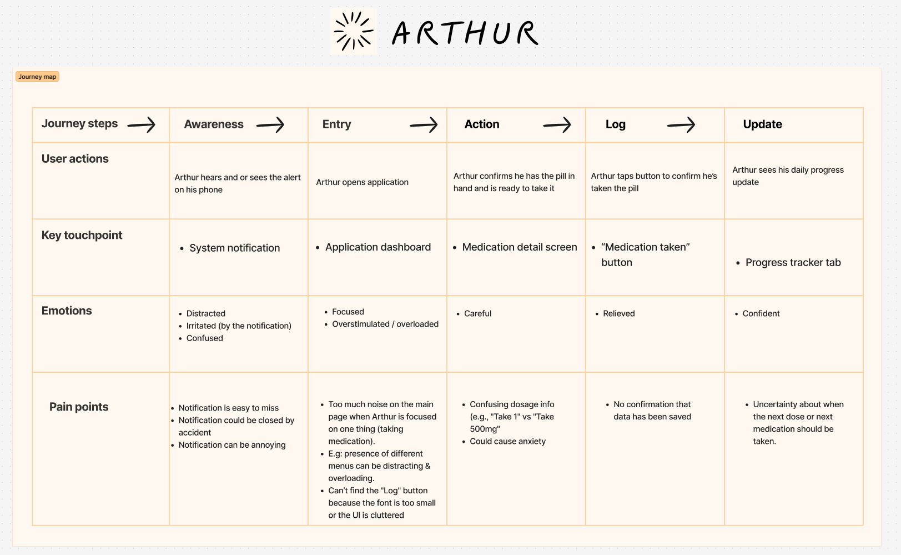

Mapping Arthur’s journey revealed that the setup phase is the most stressful. This led to the implementation of the OCR scanning feature to automate data entry.
 

Sarah’s journey highlighted that a "full app" experience is a barrier during work hours, justifying the need for lock-screen quick-actions.

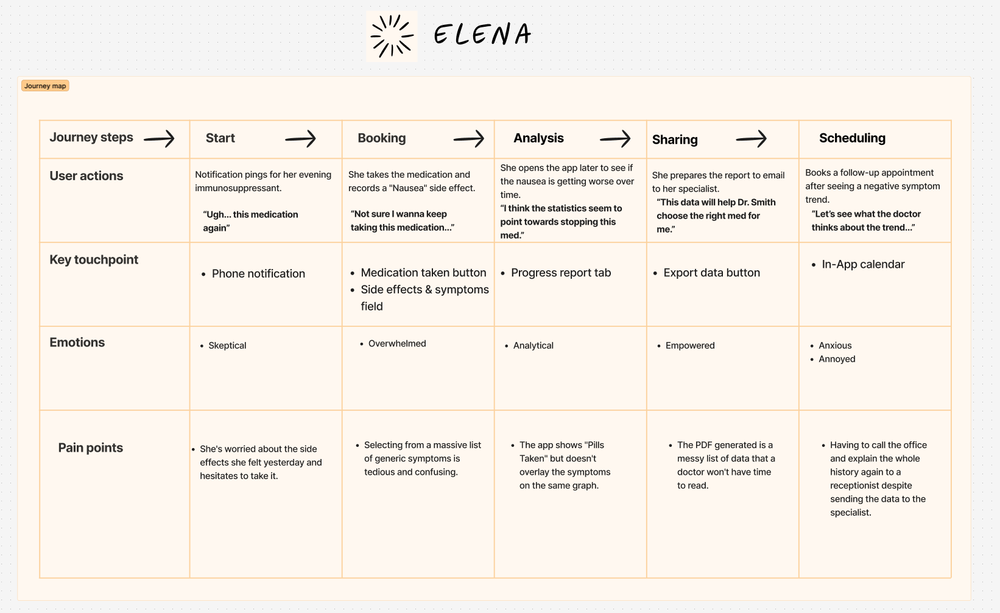
Elena’s journey showed a drop-off in confidence when confronted with ever-increasing medication side effects, which informed the creation of the clinical data export.

---

# 4. Wireframing and prototype design

Three user flow charts were produced to showcase how the application should function from the user's perspective to simplify the design process.

## 4.1 User flow chart

### Flow 1: Medication intake and escalation

This flow maps the logic for the notification problem identified in our research. It addresses the needs of personas like Arthur and Sarah, who require different levels of urgency. If the initial background notification is not acknowledged within a set parameter, the system triggers a change in the UI to a persistent, full-screen alert. This ensures that every dose is accounted for, either as taken, skipped, or snoozed.

### Flow 2: Medication onboarding (automated)

To minimize entry errors, especially for users with high cognitive loads, this flow utilizes optical character recognition using the user's phone camera. By scanning the pharmacy label, the application parses the medication name, dosage, and frequency directly into the database. It allows users like Arthur (senior) to easily add medications. This removes the manual data-entry step where most identification errors occur.

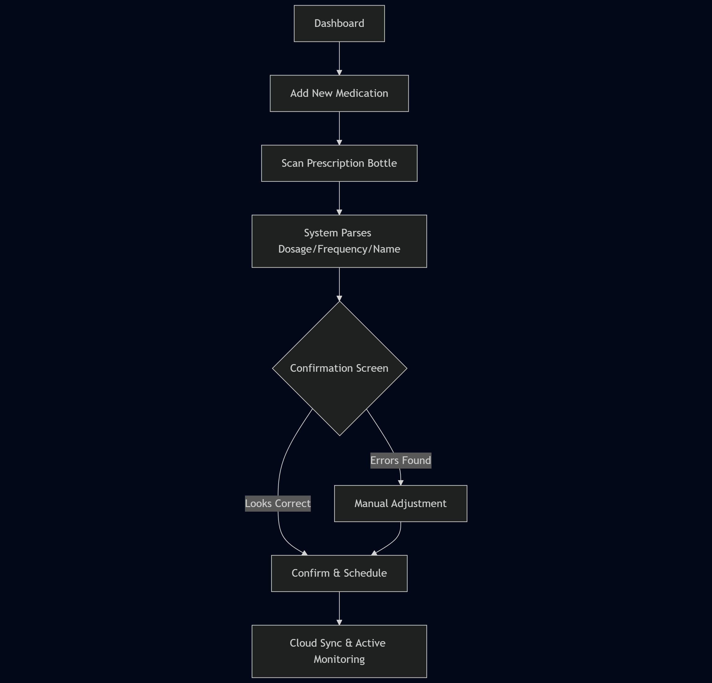

### Flow 3: Clinical data sharing and appointment scheduling

This flow represents the data export strategy. It allows users like Elena to bridge the gap between their daily tracking and professional consultations. The flow culminates in the generation of a high-fidelity PDF report, which aggregates  data from the medication logs into a format optimized for a physician's review.

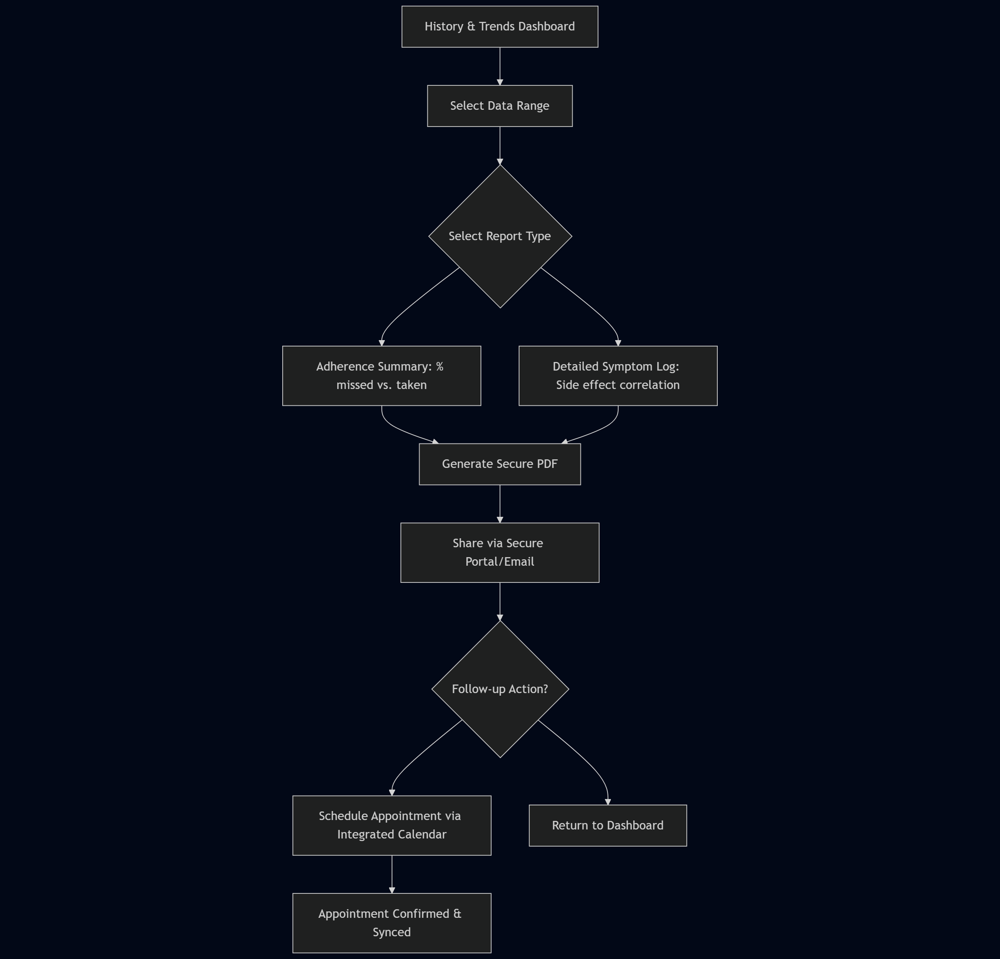

## 4.2 Sketches

The following sketches represent the core interface of HealthPro. The layout prioritizes a minimalist user interface to ensure that users can log actions with a single tap, reducing the cognitive effort required for daily adherence.

### Main screens

These screens provide a high-level overview of the user’s health status. The Medication tab acts as the primary landing page, while the Progress and Doctor tabs house the data and communication tools identified in the research phase respectively.

| Medication tab | Progress tab | Doctor tab |
|:---:|:---:|:---:|
| 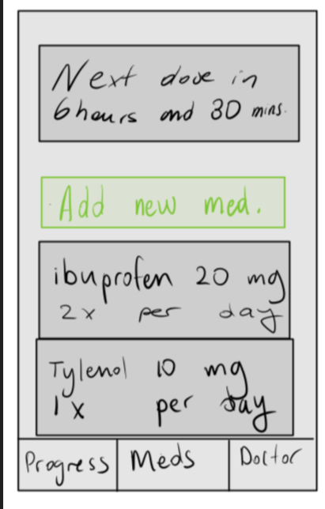 | 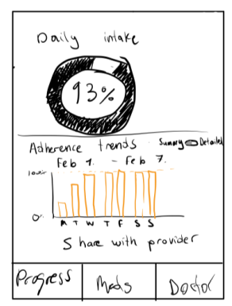 | 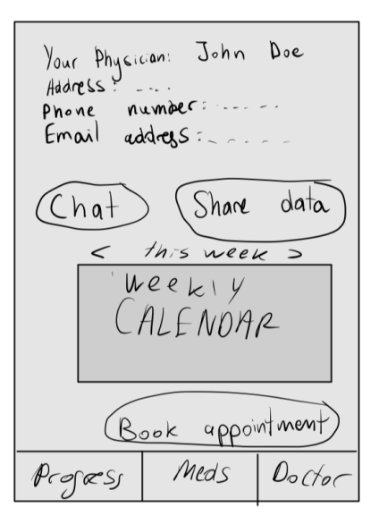 |

### Tiered notification system

Following the "Swiss Cheese" model, the notification system escalates based on user response. The lock-screen notification provides a non-intrusive nudge, while the full-screen notification acts as a persistent alarm for unlogged, missed doses.

| Lock-screen notification | Full-screen notification |
|:---:|:---:|
|  |  |

| Medication taken | Medication skipped |
|:---:|:---:|
| 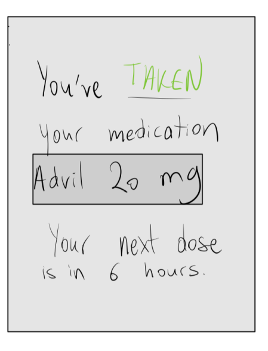 |  |

### Automated Onboarding (OCR)

To solve the "entry error" problem, the onboarding flow uses a camera interface to scan pharmacy labels. The confirmation screen allows the user to verify the parsed data before it is committed to the database.

| Camera | Confirmation |
|:---:|:---:|
|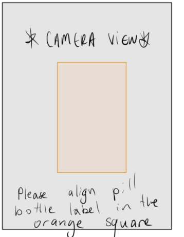|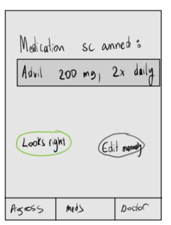|

## 4.3 Storyboards

The first story is about Arthur, a confused senior who simply wants to add his new prescription to HealthPro after getting home from the pharmacy. He has poor eyesight and the text on the pill bottle is too small to read.

| Trigger | Resolution | Relief|
|:---:|:---:|:---:|
|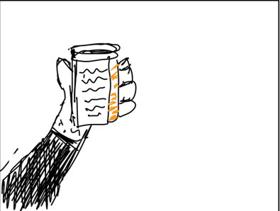 Arthur has a hard time reading the pill label|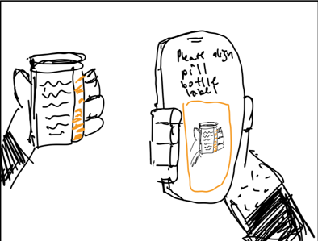 Arthur scans the label using HealthPro|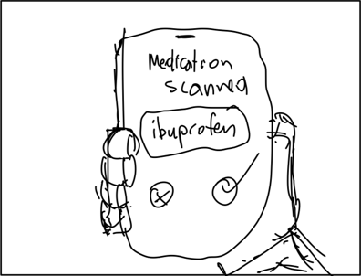 The medication is added automatically|

 
The second story is about Sarah, a professional with ADHD, stuck in a Zoom meeting. She knows it is soon time to take her medication, but does not know exactly when, and does not want to disrupt her meeting.

| Trigger | Resolution | Relief|
|:---:|:---:|:---:|
|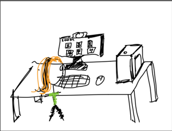 Sarah is in an important zoom meeting|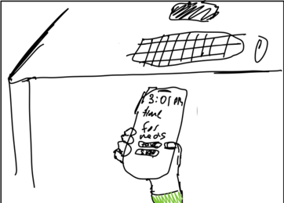Sarah receives the lock-screen notification|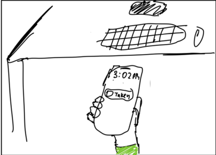 Sarah uses quick-actions to "take" her medication in HealthPro without losing focus|

 
The third story is about Elena, a scientist newly diagnosed with Lupus. She is worried about the side effects caused by her new medication and would like to export the data in a readable format to show her physician in her next appointment.

| Trigger | Resolution | Relief|
|:---:|:---:|:---:|
|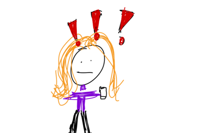 Elena is anxious about her symptoms|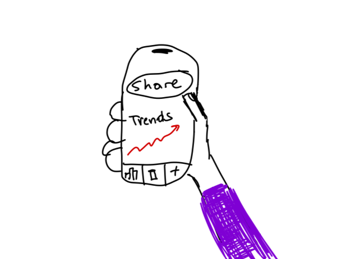 Elena looks at her health trends and sends the data to her physician|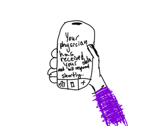 Elena is relieved to see her physician will receive her data for review|

## 4.4 Wireframes

The following wireframes represent a more refined version of the sketches shown in section 4.2. They were made using Figma.

> For a more detailed view, please see [the Figma page](https://www.figma.com/design/4Tzmq4J5wWP4CLoe9Opatt/%F0%9F%93%B2Wireframes-for-mobile-UI-design--Community-?node-id=977-2)

### Main tabs

The three-tab system was chosen to keep the interface shallow. By keeping Medications, Progress, and Clinical Contact only one tap away, we reduce the navigation fatigue often found in portal apps like MyChart. This makes navigation for older users less familiar with technology (like Arthur) far simpler.

| Medication tab | Progress tab | Doctor tab |
|:---:|:---:|:---:|
| 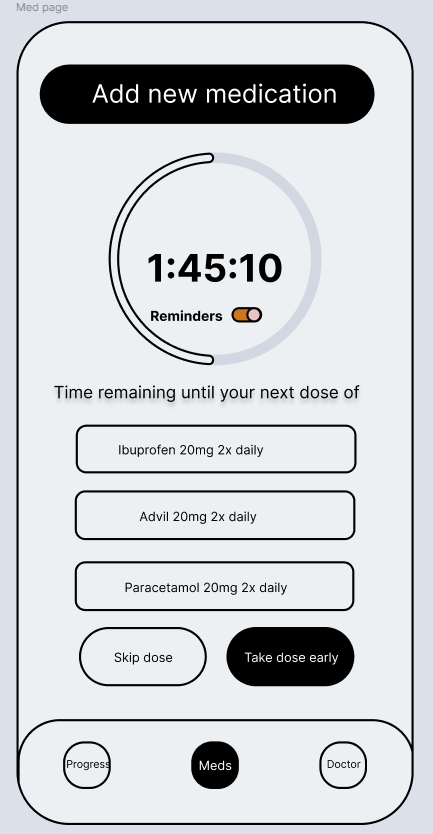 | 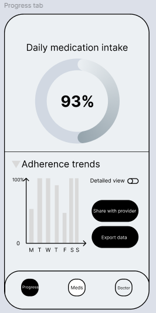 |  |

### Taking and or skipping doses

The wireframe emphasizes large, distinct hit-boxes for logging actions, such as why a dose was skipped. This design is specifically tailored for users like Sarah, who need to log data quickly, and Arthur, who may have reduced dexterity. It also allows for users to specify why they skipped their dose (already taken, side-effects, etc) or to log any side-effects encountered when taking the medication.

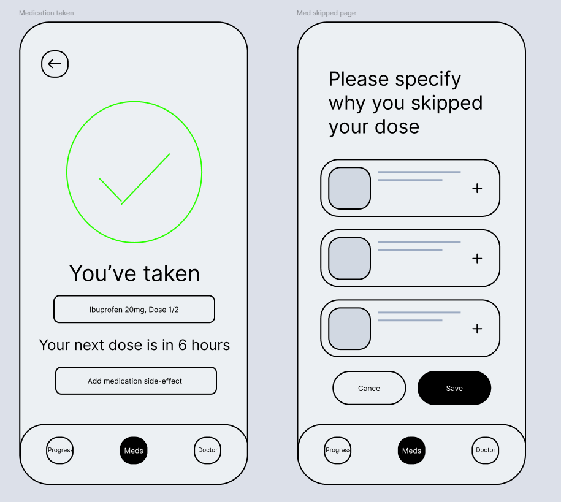

### Tiered notification system

Based on our "Swiss Cheese" model, these wireframes show the transition from a passive notification to a high-priority, full-screen takeover.
Note that notification screens 2 and 4 are resulting from pressing the buttons on the lock screen. If a user does not do that in a timely manner, the orange full-screen alert message will appear.

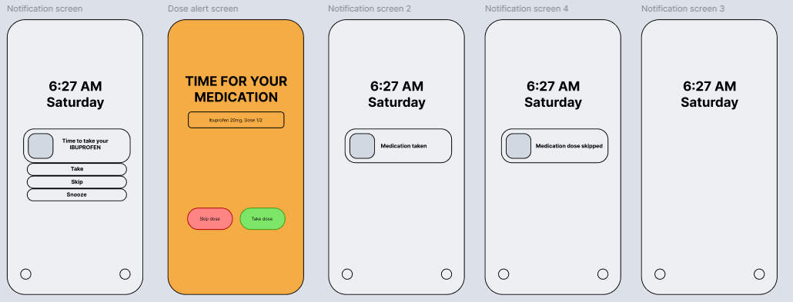

### Data exporting and various confirmation screens

The data export and confirmation screens are designed to be easy to read at a glance. Instead of complex tables, we use high-contrast summaries that are ready for clinical review. Also, users are able to send the data to themselves (seen in the 3rd screen) or to their physicians (seen in the 4th screen.)

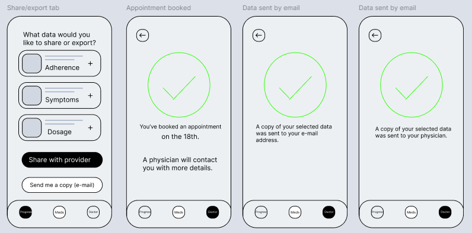

### Chatting with physician

This interface utilizes familiar mobile messaging patterns (like WhatsApp or iMessage) to reduce the learning curve. Read receipts were specifically added to address the "Ghost Messaging" issue identified in the user research, providing the user with the relief that their message was received.

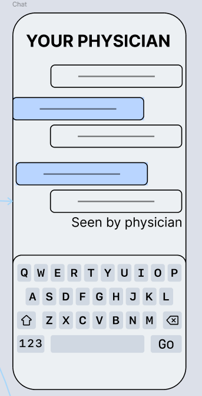

## 4.5 Clickable prototype

Because the application relies on time-sensitive alerts and tiered interactions, an interactive prototype was developed to simulate the user experience.

Access the Prototype: [HealthPro Interactive Prototype](https://www.figma.com/proto/4Tzmq4J5wWP4CLoe9Opatt/%F0%9F%93%B2Wireframes-for-mobile-UI-design--Community-?node-id=977-3&p=f&t=V4vgXETXQLUY46j3-1&scaling=min-zoom&content-scaling=fixed&page-id=977%3A2&starting-point-node-id=977%3A3&show-proto-sidebar=1)

The prototype is organized into three distinct flows.

First, the lock-screen flow demonstrates the 'Passive Nudge' where users like Sarah can log doses via quick-actions without opening the app. Second, the alert flow simulates the persistent escalation for personas like Arthur who have missed a primary notification. Finally, the 'Happy Path' flow is a comprehensive walkthrough of the main application, including medication onboarding (OCR), health progress tracking, and physician messaging.

---

# 5. Usability testing plan

The primary objective of this testing is to verify that HealthPro functions as intended in real-world scenarios and tangibly improves the quality of life for its users. Rather than focusing solely on button-clicks, our goals center on measuring the app's impact on a user's health journey. We aim to determine if the system successfully automates the tedious or error-prone parts of healthcare, such as manual data entry and report generation, to see if we have effectively reduced the cognitive burden for users with ADHD or high-stress occupations. Ultimately, we are testing for a sense of empowerment. We want to answer "does this data sharing make the patient feel more prepared, transparent, and confident during their medical appointments?"

To ensure the application improves lives across a spectrum of needs, we will test with a diverse group of participants. This includes seniors, like our Arthur profile, to see if automated onboarding removes the fear of 'doing it wrong' in less tech-savvy individuals, as well as neurodivergent users to ensure our tiered notifications act as a helpful safety net rather than a source of anxiety. We will also include worried, newly diagnosed patients like Elena to verify that our clinical export tools provide a genuine sense of agency when communicating with specialists.

During the testing sessions, participants will undergo a "stress test" consisting of three core tasks. First, we will ask the user to scan and set a priority alert for a new, critical medication. Second, the efficiency task requires them to log a dose quickly during a simulated busy meeting to test the app's speed. Finally, the empowerment task asks them to generate a 30-day adherence report as if they were in a doctor’s waiting room. Throughout these tasks, we will utilize the 'think aloud' method to capture real-time feedback.

The final stage involves a deep analysis of user friction and sentiment. We will look for any moments where users hesitate or express frustration; from a UX standpoint, if a user feels confused while navigating the app, the design has failed its objective to improve their life. Through sentiment analysis, we will ask users if they feel more or less in control of their health after using the prototype. This feedback will drive our iterative design process, allowing us to soften clinical language in the chat or redesign the camera interface if the OCR scan proves too rigid, ensuring the final product is perfected.

---

# 6. Reflection

The UX design process served as a critical tool for identifying user needs and improving the final product. The initial assumption for the project was the creation of a simple digital pill-box application. However, the research and persona development revealed that users required more than just basic reminders. This shifted the focus toward a more specialized application, leading to the implementation of a tiered notification system and clinical data sharing features.

The primary challenge encountered during the design process was balancing fidelity with clarity. The initial stage involved rapid, low-fidelity sketching and storyboarding to map out core user journeys. While these early drawings focused on raw logic rather than aesthetics, they provided the necessary blueprint for the transition into digital design. The main difficulty lay in translating those basic ideas into low-fi wireframes. During this process, it became clear that a "trendy" UI would be less effective than a high-contrast, simple interface, especially for the wireframes. Non-essential elements were removed to keep the screens easy to read, which resulted in a more accessible final design for our personas.

Furthermore, learning Figma while designing the logic of the application presented a steep learning curve, requiring significant trial and error. This obstacle was managed by adopting a modular design approach; creating consistent buttons and navigation components early in the process ensured the final clickable prototype functioned as a unified application rather than a collection of screens.
